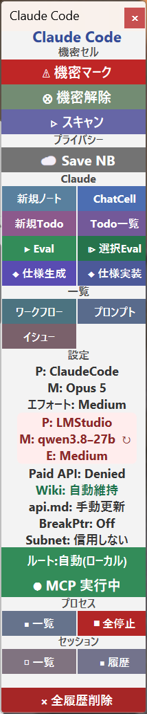

## 設計思想と実装の概要

ClaudeCode は以下の設計原則に基づいています。

- **ノートブック中心**: すべての操作はノートブック上で完結します。CLI を直接操作する必要はありません。
- **非同期実行**: LLM への問い合わせは非同期で実行され、ノートブックの操作を妨げません。リアルタイムのストリーミング進捗表示により、思考中・テキスト生成中・ツール実行中の状態を確認できます。
- **安全なパッケージ管理**: パッケージの更新はバックアップ・差分マージ・安全性検証・再ロードを自動で行います。排他ロック機構により、同一パッケージへの並列更新を防止します。更新後は自動生成された検証テストが実行され、意図した変更が正しくコードに反映されているか確認します。
- **差分ベースバックアップ**: バックアップは SequenceAlignment ベースの差分形式（.cz / .cdiff / .unchanged）で保存され、ストレージ消費を大幅に削減します。既存の生バックアップは `ClaudeMigrateBackupHistory` で差分形式に変換できます。
- **機密データ保護**: `Confidential[]` による秘匿変数システムと、プライバシー考慮型モデルルーティングにより、機密データの安全な取り扱いを実現します。アクセスレベルに基づいて、クラウドモデルとローカルモデルを自動的に使い分けます。
- **多段フォールバック**: Claude Code CLI が利用不可の場合、アクセスレベルに応じたフォールバックモデルに自動切替します。Anthropic API、OpenAI API、LM Studio 等のローカルモデルを順次試行します。
- **セッション管理**: 会話履歴をノートブックの TaggingRules に永続化し、差分圧縮と自動コンパクションによりストレージを効率的に利用します。
- **多言語対応**: `$Language` 設定に基づいてプロンプトの言語指示を動的に生成します。`$Language` が `"Japanese"` の場合は日本語で応答するよう指示し、それ以外の場合は英語に切り替わります。
- **AI 生成機能**: OpenAI Images API による画像生成（`ClaudeImageGenerate`）と OpenAI TTS API による音声生成（`ClaudeSpeech`）を統合しています。
- **プロジェクト固有ディレクティブ**: ノートブックディレクトリごとに独立したルール・スキルを定義し、メインのディレクティブと自動マージできます。
- **claudecode_directives 連携**: オプションの独立パッケージ [claudecode_directives](https://github.com/transreal/claudecode_directives) をロードすることで、`rules/` および `skills/` ディレクトリのデフォルトセットが自動的にインストールされます。ロード後は Claude Code CLI のコンテキストに rules/ の制約と skills/ の手順が自動的に注入され、Claude がスキルを呼び出せるようになります。claudecode.wl 本体はディレクティブの内容に非依存であり、claudecode_directives がその管理を担います。
- **スマートドキュメント管理**: ドキュメント生成・更新時のモード制御（新規作成・既存更新）、部分更新対象の指定、差分検出による効率的な更新処理を提供します。
- **分離原則検証**: NBAccess パッケージとの適切な分離を維持するため、コード内の分離原則違反を自動検出・修正する機能を備えています。
- **パッケージキーワード自動注入**: 各パッケージが独自のキーワードを登録し、プロンプト中にキーワードが含まれる場合に自動的にそのパッケージの API ドキュメントをコンテキストに注入します。
- **自動実行安全ガード**: `ClaudeEval` の `AutoEvaluate -> True` で生成コードを自動実行する際、`NBAutoEvalProhibitedPatterns` に定義された禁止パターンに該当するコードの自動実行をブロックします。これにより、ファイル削除や危険なシステム操作などを含むコードが意図せず実行されることを防止します。
- **共有ポーリングタスク**: 複数の非同期ジョブが実行中の場合、すべてのジョブが単一の共有ポーリングタスクを利用します。旧実装のようにジョブごとに個別の `ScheduledTask` を作成しないため、多数のジョブを並列実行した際のオーバーヘッドが大幅に削減されます。`iEnsureSharedPollingTask` により共有タスクのライフサイクルが管理され、パッケージリロード時には旧タスクが自動的に停止されます。
- **非同期スケジューリング規約の自動注入**: `ClaudeUpdatePackage` のプロンプトに、非同期タスクのスケジューリング規約（claudecode/NBAccess 公開 API の使用義務・例外条件・根拠）を自動注入します。LLM が生成するパッケージコードが正しい非同期パターンに従うよう誘導します。
- **Windows エンコーディング安全な API 通信（マルチモーダル対応）**: `ClaudeQueryBg` はテキスト・`Image`・`File` オブジェクトを混在したリスト形式の入力に対応しています。CLI パスでは `iNormalizePrompt` 経由で画像を PNG に変換して送信し、API フォールバックパス（`Fallback -> True`）では Anthropic API のマルチモーダル `content` 配列を構築して送信します。リクエストボディは `ExportByteArray["JSON"]` で UTF-8 ByteArray として送信し、非 ASCII 文字は `\uXXXX` JSON エスケープに変換します。レスポンスは `ImportByteArray["RawJSON"]` で ByteArray のまま直接 JSON パースするため、Windows 固有の暗黙的エンコーディング変換（ShiftJIS 等）による日本語文字化けが発生しません。
- **ClaudeRuntime 統合**: オプションの独立パッケージ [ClaudeRuntime](https://github.com/transreal/ClaudeRuntime) をロードすると、`ClaudeEval` のバックエンドとしてランタイムセッション管理機能が有効になります。ランタイムはターン数・プロファイル・失敗履歴を追跡し、危険な操作に対して承認フロー（`NeedsApproval`）を提供します。`$UseClaudeRuntime = False` で無効化することで後方互換性を維持できます。
- **ClaudeOrchestrator 連携**: オプションの独立パッケージ [ClaudeOrchestrator](https://github.com/transreal/ClaudeOrchestrator) をロードすると、`ClaudeEval` がオーケストレーター管理下の非同期実行モードに切り替わります。呼び出しはジョブキューに追加されて即座に返り、カーネルをブロックしません。rate-limit 検出・自動待機・リトライスケジューリングが透過的に処理され、長時間・大規模なタスクを安定して継続実行できます。`ClaudeRateLimitStatus[]` が返す復旧予定時刻を参照して待機タイミングを自動判断します。
- **[実験的] LLM 適用グラフ (LLMGraph)**: LLM の適用を DAG（有向非巡回グラフ）として自動記録・可視化します。Mathematica 14.2 の `LLMGraph` と類似の構造を採用した独自実装で、`ClaudeEval` / `ClaudeQuery` 実行時にノートブック固有のグラフが自動生成されます。この実装は `claudecode_info/design/` にある WOOC'92 / WOOC'93 論文で議論されている、データの構造を保ったまま定義域ごとに適応的に処理を適用するモデルを下敷きにしています。`$LLMGraphMaxConcurrency` によりカテゴリ別の並列度を制御でき、DAG ジョブの作成・実行・キャンセル・再構築を行う `LLMGraphDAGCreate` / `LLMGraphDAGRebuild` 系の API も提供されます。
- **[実験的] プライバシー分割ファイル処理 (ClaudeProcessFile)**: LLMGraph の応用として、ノートブックファイルのセルをプライバシーレベルで分割し、クラウド LLM とプライベート LLM で並列処理してマージする機能を提供します。

内部的には、[NBAccess](https://github.com/transreal/NBAccess) パッケージにノートブックのセル操作・プライバシー管理・履歴 DB を委譲し、[GitHubREST](https://github.com/transreal/github) パッケージと連携して GitHub 上のパッケージ管理を行います。

## 詳細説明

### 動作環境

- Wolfram Mathematica 13.x 以降
- Windows 11（macOS/Linux ではパス区切りやシェルコマンドを適宜読み替えてください）
- Claude Code CLI がインストール済みで、パスが通っていること
- Node.js（node-pty によるインタラクティブ CLI 実行に使用）
- [NBAccess](https://github.com/transreal/NBAccess) パッケージ（`NBAccess.wl`）
- [GitHubREST](https://github.com/transreal/github) パッケージ（`github.wl`）— オプション、GitHub 連携時に必要

### インストール

基盤パッケージ（`claudecode.wl`, `NBAccess.wl`, `github.wl`）は `$packageDirectory` に直接配置します。

```mathematica
(* $Path に $packageDirectory を追加 *)
AppendTo[$Path, $packageDirectory]

(* パッケージの読み込み (UTF-8 環境で) *)
Block[{$CharacterEncoding = "UTF-8"},
  Needs["ClaudeCode`", "claudecode.wl"]];
```

claudecode を使用している場合、`$Path` は自動的に設定されます。

ディレクティブ管理機能を使用する場合は、[claudecode_directives](https://github.com/transreal/claudecode_directives) パッケージ（`claudecode_directives.wl`）をオプションでロードします。

```mathematica
(* ディレクティブ管理機能を使用する場合（オプション） *)
Block[{$CharacterEncoding = "UTF-8"},
  Needs["ClaudeCodeDirectives`", "claudecode_directives.wl"]];
```

### 基本設定

```mathematica
(* 使用するモデルの指定（空文字列で Claude Code のデフォルトモデル） *)
$ClaudeModel = "claude-sonnet-4-20250514"

(* $ClaudeModel を LM Studio に直接設定する例（Web 検索等を LM Studio で実行したい場合） *)
$ClaudePrivateModel = {"lmstudio", "qwen/qwen3.6-27b", "http://127.0.0.1:1234"}
$ClaudeModel = $ClaudePrivateModel

(* LM Studio 使用時に有効にする MCP インテグレーション *)
(* mcp.json に登録済みの MCP サーバー ID を指定する。LM Studio がサーバー側で tool-call を自動実行する。 *)
$ClaudeLMStudioIntegrations = {"mcp/exa"}

(* フォールバックモデルの設定 *)
$ClaudeFallbackModels = {
  {"anthropic", "claude-opus-4-6"},
  {"lmstudio", "openai/gpt-oss-20b", "http://127.0.0.1:1234"}
}

(* 機密データ処理用ローカルモデル *)
$ClaudePrivateModel = {"lmstudio", "openai/gpt-oss-20b", "http://127.0.0.1:1234"}

(* タイムアウト（秒） *)
$ClaudeTimeout = 1200

(* ClaudeEval 再帰深度上限 *)
$ClaudeEvalMaxDepth = 5

(* ドキュメント生成用モデル *)
$ClaudeDocModel = "claude-sonnet-4-20250514"

(* 分離検証用モデル *)
$ClaudeTestModel = $ClaudeModel

(* 画像生成モデル優先順位 *)
$ClaudeImageModels = {{"openai", "gpt-image-1"}, {"openai", "dall-e-3"}}

(* 音声生成モデル優先順位 *)
$ClaudeTTSModels = {{"openai", "tts-1-hd"}, {"openai", "tts-1"}}

(* アクセス可能ディレクトリ *)
$ClaudeAccessibleDirs = {$packageDirectory, "C:\\Users\\...\\作業フォルダ"}

(* 作業ディレクトリ *)
$ClaudeWorkingDirectory = FileNameJoin[{$HomeDirectory, "Claude Working"}]

(* パッケージキーワード自動注入マップ *)
$ClaudePackageKeywordMap = <||>

(* LLMGraph カテゴリ別並列度 (デフォルト値を変更する場合) *)
$LLMGraphMaxConcurrency["cli"] = 4        (* CLI テキスト呼び出し *)
$LLMGraphMaxConcurrency["cli-vision"] = 1 (* CLI 画像付き呼び出し *)

(* ClaudeRuntime の有効/無効 (ClaudeRuntime パッケージロード時のみ有効) *)
$UseClaudeRuntime = True
```

### パッケージキーワード自動注入システム

ClaudeCode は `$ClaudePackageKeywordMap` を通じて、各外部パッケージが独自のキーワードを登録し、プロンプト中にそれらのキーワードが含まれる場合に自動的にそのパッケージの API ドキュメントをコンテキストに注入する機能を提供します。

```mathematica
(* パッケージキーワードの登録例 *)
$ClaudePackageKeywordMap["maildb"] = {"メール", "mail", "切"}
$ClaudePackageKeywordMap["github"] = {"GitHub", "プルリク", "コミット"}

(* 登録後、プロンプトに "メール" が含まれると maildb の api.md が自動注入される *)
ClaudeQuery["メールデータベースの操作方法を教えて"]
```

このシステムにより、各パッケージが自身のロード時にキーワードを登録することで、claudecode.wl はパッケージ非依存を保ちつつ、必要な API ドキュメントを自動的に提供できます。

### クイックスタート

```mathematica
(* 同期的に Claude に問い合わせ（テキスト応答） *)
ClaudeQuery["Mathematicaでフィボナッチ数列を生成する方法を教えてください"]

(* 非同期でコードを生成・実行 *)
ClaudeEval["素数判定関数を書いてください"]

(* 会話を継続 *)
ContinueEval["もう少し効率的な方法はありますか？"]

(* フォールバック付きで実行 *)
ClaudeEval["データ分析コードを書いて", Fallback -> True]

(* 機密データの自動ルーティング *)
成績 = Confidential[First @ Import[FileNameJoin[{Quiet @ Check[NotebookDirectory[], $packageDirectory], "成績.xlsx"}], {"Dataset"}]]
ClaudeEval["この成績データを分析してください", AutoPrivate -> True]

(* パッケージの更新 *)
ClaudeUpdatePackage["MyPackage", "エラーハンドリングを改善"]

(* ドキュメント生成 *)
ClaudeCreateDocumentation["MyPackage"]

(* AI 画像生成 *)
ClaudeImageGenerate["桜の満開の写真、フォトリアル"]

(* AI 音声生成 *)
ClaudeSpeech["こんにちは、世界"]

(* GitHub コミット準備 *)
ClaudePrepareCommit["MyPackage"]
```

### 主な機能

| カテゴリ | 機能 | 説明 |
|---|---|---|
| **問い合わせ** | `ClaudeQuery` | 同期的にテキスト応答を取得 |
| | `ClaudeEval` | 非同期でコード生成・実行 |
| | `ContinueEval` | 会話の継続・エラー修正 |
| | `ClaudeSpec` | 仕様書の生成 |
| **パッケージ管理** | `ClaudeCreatePackage` | 新規パッケージ作成 |
| | `ClaudeUpdatePackage` | バックアップ付きパッケージ更新 |
| | `ContinueUpdate` | 直前の更新を継続・バグ修正 |
| | `ClaudeRestorePackage` | バックアップからの復元 |
| | `ClaudeConvertToPaclet` | Paclet 形式への変換 |
| **ドキュメント** | `ClaudeCreateDocumentation` | ドキュメント一式の自動生成 |
| | `ClaudeUpdateDocumentation` | 差分検出による自動更新・モード制御機能 |
| **バックアップ** | `ClaudeBackupDataset` | バックアップ履歴の管理・復元 |
| | `ClaudeMigrateBackupHistory` | 生バックアップを差分形式に変換 |
| **機密データ** | `Confidential` / `NonConfidential` | 変数の秘匿・解除 |
| | `MarkConfidential` / `UnmarkConfidential` | セルの秘匿マーク |
| | `ScanConfidentialCells` | 依存セルの自動検出・マーク |
| **プライバシー** | `$ClaudePrivateModel` | ローカルモデル設定 |
| | `AutoPrivate` オプション | 機密データ自動ルーティング |
| | `PrivacySpec` オプション | アクセスレベル明示指定 |
| **セッション** | `CreateClaudeSession` | 名前付きセッション作成 |
| | `ClaudeShowHistory` | 履歴表示 |
| | `ClaudeCompactHistory` | 履歴コンパクション |
| | `ClaudeHistorySize` | 履歴サイズ診断 |
| | `ClaudeAttach` / `ClaudeDetach` | 参考資料のアタッチ |
| **ディレクティブ** | `ClaudeAddDirective` | ルール・スキルの追加 |
| | `ClaudeUpdateDirective` | ディレクティブの自動整合・テキスト指示更新 |
| | `ClaudeSyncDirectives` | 外部フォルダからの同期 |
| | `ClaudeDirectiveBackupDataset` | ディレクティブ更新履歴の管理 |
| | `ClaudeInitProject` | プロジェクト固有ディレクティブの初期化 |
| | `ClaudePromoteProjectDirectives` | ローカルディレクティブをグローバルに昇格 |
| **AI 生成** | `ClaudeImageGenerate` | OpenAI Images API で画像生成 |
| | `ClaudeSpeech` | OpenAI TTS API で音声生成 |
| **Web** | `ClaudeWebSearch` | Web 検索（Claude Code 組み込み） |
| | `ClaudeWebFetch` | URL 内容取得・要約（Anthropic API） |
| **ClaudeRuntime** | `ClaudeStartRuntime` | ランタイムの起動 |
| | `ClaudeEvalViaRuntime` | ランタイム経由での評価 |
| | `ClaudeUpdatePackageViaRuntime` | ランタイム経由でのパッケージ更新 |
| | `ClaudeApproveProposal` | 承認待ち提案の承認 |
| | `ClaudeRuntimeSnapshot` | ランタイムのスナップショット保存 |
| | `ClaudeRuntimeRestore` | スナップショットからの復元 |
| | `ClaudeRuntimeRetry` | 失敗ターンの再試行 |
| | `ClaudeRuntimeListSnapshots` | スナップショット一覧 |
| | `ClaudeBuildRuntimeAdapter` | ランタイムアダプタの構築 |
| | `ClaudeBuildTransactionAdapter` | トランザクションアダプタの構築 |
| | `$UseClaudeRuntime` | ランタイム有効/無効の切り替え |
| | `$ClaudeLastRuntimeId` | 最後に使用したランタイム ID |
| **[実験的] LLMGraph** | `NotebookLLMGraphPlot` | DAG 可視化 |
| | `NotebookLLMGraphNodes` | 全ノード取得 |
| | `NotebookLLMGraphSummary` | Status/L2 統計 Dataset |
| | `NotebookLLMGraphValidate` | 整合性検証 |
| | `NotebookLLMGraphExtractThread` | 実行スレッド抽出 |
| | `NotebookLLMGraphApplyThread` | Thread を別対象に再適用 |
| | `NotebookLLMGraphRerun` | ノード再実行 |
| | `LLMGraphDAGCreate` | DAG ジョブの作成 |
| | `LLMGraphDAGStatus` | DAG ジョブのステータス取得 |
| | `LLMGraphDAGCancel` | DAG ジョブのキャンセル |
| | `LLMGraphDAGStop` | DAG ジョブの停止 |
| | `LLMGraphDAGRetry` | DAG ジョブの再試行 |
| | `LLMGraphDAGRebuild` | 指定ノードを差し替えた新 DAG の構成・起動 |
| | `LLMGraphExecute` | LLMGraph ジョブの実行 |
| | `LLMGraphExecuteStatus` | LLMGraph ジョブのステータス取得 |
| | `LLMGraphExecuteCancel` | LLMGraph ジョブのキャンセル |
| | `$LLMGraphMaxConcurrency` | カテゴリ別並列度の制御 |
| **[実験的] ファイル処理** | `ClaudeProcessFile` | プライバシー分割並列処理 |
| **分離検証** | `ClaudeCheckSeparation` | NBAccess 分離原則の違反検査 |
| | `ClaudeFixSeparation` | 違反の自動修正 |
| **Git 連携** | `ClaudePrepareCommit` | 変更履歴収集・コミット準備 |
| **ユーティリティ** | `ShowClaudePalette` | 操作パレット表示 |
| | `ClaudeStatus` | 実行中タスクの状態表示 |
| | `ClaudeCommand` | CLI スラッシュコマンド実行 |

### 操作パレット

`ShowClaudePalette[]` を実行すると、Claude Code の主要操作をワンクリックで呼び出せるパレットが表示されます。

```mathematica
ShowClaudePalette[]
```



パレットは上から以下のセクションに分かれています。

#### 機密セル セクション

| ボタン | 説明 |
|---|---|
| **△ 機密マーク** | 選択中のセルを機密セルとしてマークします。マークされたセルの内容は ClaudeQuery/ClaudeEval のプロンプトから除外されます。 |
| **⊗ 機密解除** | 選択中のセルの機密マークを解除します。 |
| **▷ スキャン** | ノートブック全体をスキャンし、機密変数を参照するセルを自動的に機密マークします（`ScanConfidentialCells[]` に相当）。 |

#### Claude セクション

| ボタン | 説明 |
|---|---|
| **▷ ClaudeQuery** | 選択中のセル内容またはノートブックコンテキストをもとに `ClaudeQuery` を実行します。同期的にテキスト応答を返します。 |
| **► ClaudeEval** | 選択中のセル内容またはノートブックコンテキストをもとに `ClaudeEval` を実行します。コードを非同期で生成・実行します。 |
| **▷ 選択→Query** | 現在選択中のセルの内容を取得して `ClaudeQuery` に渡します。 |
| **▷ 選択→Eval** | 現在選択中のセルの内容を取得して `ClaudeEval` に渡します。 |
| **◆ 仕様生成** | 選択中のセル内容またはノートブックコンテキストから `ClaudeSpec` を実行し、仕様書を生成します。 |
| **■ 実行停止** | 実行中の全 Claude タスクを停止します（`ClaudeAbort[]` に相当）。 |

#### 設定セクション

パレット下部の設定エリアでは、以下のパラメータをノートブックごとに保存・変更できます。設定はノートブックの TaggingRules に永続化されます。

| 設定項目 | 選択肢 | 説明 |
|---|---|---|
| **モデル** | Opus / Sonnet / Default | 使用するモデルを切り替えます。Opus は `$iModelOpus`、Sonnet は `$iModelSonnet`、Default は `$ClaudeModel` のデフォルト（空文字列）に対応します。 |
| **エフォート** | Low / Medium / High / Max | Think トリガーの強度を設定します。Low は思考なし、Medium は `think hard`、High は `think harder`、Max は `ultrathink` に対応します。 |
| **課金API** | 禁止 / 許可 | `Fallback -> True/False` を制御します。「禁止」では Claude Code CLI のみ使用し、「許可」では CLI 利用不可時に Anthropic API 等へフォールバックします。 |

#### セッション セクション

| ボタン | 説明 |
|---|---|
| **■ 履歴表示** | デフォルトセッションの会話履歴を表示します（`ClaudeShowHistory[]` に相当）。 |
| **□ セッション一覧** | ノートブック内の全セッション一覧を表示します（`ClaudeListSessions[]` に相当）。 |

#### ステータス表示

パレット最下部には現在のノートブックにおける機密セル数と機密依存セル数がリアルタイムで表示されます（例: `機密: 0, 依存: 0`）。

#### 言語切り替え

パレットの表示言語は `$Language` 設定に連動します。`$Language` が `"Japanese"` の場合は日本語で表示され、それ以外の場合（英語環境など）は英語に切り替わります。たとえば英語環境では「機密マーク」は "Mark Confidential"、「実行停止」は "Abort" のように表示されます。

### プライバシー考慮型モデルルーティング

ClaudeCode は機密データを含むタスクに対して、自動的にローカルモデルへルーティングする機能を備えています。

- **`$ClaudePrivateModel`**: ローカル LLM（LM Studio 等）のモデル仕様を設定します
- **`AutoPrivate -> True`**: 機密変数にアクセスするタスクで自動的にローカルモデルを使用します
- **`PrivacySpec`**: アクセスレベルを明示的に制御します
- **3段階フォールバック**: Claude Code CLI → アクセスレベル対応フォールバックモデル → エラーの順で試行します

### LM Studio の直接使用

`$ClaudeModel` に LM Studio のモデル仕様（リスト形式）を設定することで、Claude Code CLI を使わずに LM Studio をメインの推論エンジンとして直接使用できます。これにより、ローカル LLM を用いた Web 検索や MCP ツール連携が可能になります。

#### 基本設定例

```mathematica
(* LM Studio をメインモデルとして設定 *)
$ClaudePrivateModel = {"lmstudio", "qwen/qwen3.6-27b", "http://127.0.0.1:1234"};
$ClaudeModel = $ClaudePrivateModel;

(* MCP インテグレーションを設定（mcp.json に登録済みの ID を指定） *)
$ClaudeLMStudioIntegrations = {"mcp/exa"};

(* Web 検索を伴う質問を実行 — LM Studio が exa で検索して回答 *)
ClaudeEval["Claude Code について最新の情報を調べてほしい。"]
```

`$ClaudeLMStudioIntegrations` に MCP サーバー ID を指定すると、LM Studio がサーバー側で tool-call ループを自動実行します。フロントエンドをブロックせずに MCP ツール（exa による Web 検索等）を利用できます。MCP 使用時はコンテキスト長として 16000 以上を推奨します。

#### $ClaudeLMStudioIntegrations の指定形式

| 形式 | 例 | 説明 |
|---|---|---|
| 文字列リスト | `{"mcp/exa"}` | `mcp.json` に登録済みの MCP サーバー ID を指定 |
| Plugin 形式 | `{<|"type"->"plugin","id"->"mcp/exa",...|>}` | 詳細オプション付きで指定 |
| Ephemeral MCP 形式 | `{<|"type"->"ephemeral_mcp",...|>}` | 一時的な MCP サーバーをインライン定義 |

#### 認証設定（Require Authentication）

LM Studio の **Server Settings** で **Require Authentication** を有効にすると、API キーが要求されます。このキーは NBAccess が管理する `SystemCredential` に登録することで、ClaudeCode が自動的に取得して使用します。

**設定手順:**

1. LM Studio を起動し、**Server Settings** を開く
2. **Require Authentication** を **On** に切り替える
3. 表示された API キーをコピーする
4. Mathematica で以下を実行して登録する:

```mathematica
(* LM Studio の API キーを SystemCredential に登録 *)
(* キー名は接続先 URL を含む形式: "lmstudio-<URL>" *)
SystemCredential["lmstudio-http://127.0.0.1:1234"] = "your-lm-studio-api-key";
```

登録後は `ClaudeEval` 等の呼び出し時に API キーが自動取得されます。未登録の場合は認証なしのダミーキー（`"lm-studio"`）にフォールバックするため、Require Authentication が Off の通常利用では登録不要です。

**注意**: キー名に含まれる URL は `$ClaudeModel` の第3要素（カスタム URL）と一致させてください。リモートの LM Studio サーバーを使用する場合はそのサーバーの URL に合わせてキー名を変更してください。

### 多言語対応（$Language ベースの言語切り替え）

ClaudeCode は Wolfram Language の `$Language` 変数を参照して、Claude への応答言語指示を自動生成します。

- **`$Language = "Japanese"`** の場合: Claude に対して日本語で応答するよう指示します。
- **`$Language` が `"Japanese"` 以外**（例: `"English"`、その他の言語）の場合: 英語で応答するよう指示します。

この切り替えはプロンプト生成時に自動で行われるため、ユーザーが明示的に設定する必要はありません。Mathematica の言語設定に合わせて適切な応答言語が選択されます。

### 自動実行安全ガード（NBAutoEvalProhibitedPatterns）

`ClaudeEval` の `AutoEvaluate -> True`（デフォルト）では、LLM が生成したコードが自動的に実行されます。安全性を確保するため、`NBAutoEvalProhibitedPatterns` に定義された禁止パターンに該当するコードの自動実行はブロックされます。

禁止パターンに該当するコードが生成された場合、そのコードブロックは Input セルとしてノートブックに書き込まれますが、自動実行はスキップされます。ユーザーがコードの内容を確認した上で、手動で実行するかどうかを判断できます。

この機構により、ファイル削除やシステム操作など、意図しない副作用を持つ可能性のあるコードが自動実行されるリスクを軽減します。内部的には `iAutoEvalProhibitedPatterns` によって禁止パターンの照合が行われます。

### アクセス可能ディレクトリ制御

`$ClaudeAccessibleDirs` により、Claude Code がアクセスできるディレクトリを制御できます。NotebookDirectory が安全なデフォルトディレクトリ（`$packageDirectory` や `$ClaudeWorkingDirectory` 配下）でない場合、初回使用時にダイアログで許可を求めます。許可設定はノートブックの TaggingRules に永続化されます。

### パッケージ更新の排他ロック

同一パッケージに対する `ClaudeUpdatePackage` の並列実行を防ぐ排他ロック機構が組み込まれています。更新開始時にロックが取得され、完了時に自動解放されます。異なるパッケージへの同時更新は並列実行可能です。

### パッケージ更新の検証テスト

`ClaudeUpdatePackage` はコードのマージ完了後、LLM が自動生成した検証テストを実行して変更が正しく反映されているかを確認します。

#### 検証テストの仕組み

LLM はコード変更と並行して `===BEGIN_TESTS===` ～ `===END_TESTS===` マーカー間に検証テストコードを生成します。各テストは `(* テスト説明 *)` コメントの直後に Boolean 式が続く形式です。テストコードはコメント区切りでブロック分割されて順次評価されます。

```mathematica
(* 例: LLM が生成する検証テストの形式 *)
===BEGIN_TESTS===
(* showMailsのデフォルト表示数が30になっているか *)
TrueQ[Options[showMails, "MaxCount"] === {"MaxCount" -> 30}]

(* 関数 newFeature が定義されているか *)
MatchQ[Definition[newFeature], _]
===END_TESTS===
```

テスト実行後、結果がノートブックに表示されます。

| 表示 | 意味 |
|---|---|
| `✅ All verification tests passed (N)` | 全 N テストが合格 |
| `⚠️ Verification tests failed (N)` | N テストが失敗（意図した変更が欠落している可能性） |

テストが失敗した場合は `ContinueUpdate[]` で追加修正を依頼することを推奨します。

#### 未変更関数の保全検証

マージ後、LLM が変更を主張していない関数が意図せず変更されていないかを自動チェックします。変更が検出された場合は警告が表示されます（ブロック境界シフトによる可能性を含む）。実際に破損している場合は事前バックアップから復元してください。

### CUDA 拡張サポート

`ClaudeUpdatePackage` の指示内容に CUDA 関連のキーワードが含まれている場合（`CUDA`, `cuda`, `cuda.wl` 等）、自動的に `cuda.wl` 拡張を読み込もうとします。`cuda.wl` が `$packageDirectory` に存在しない場合は警告が表示され、CUDA 拡張なしで処理が継続されます。

### 依存関数の自動検出（スマートターゲティング）

`ClaudeUpdatePackage` の `TargetFunctions -> Automatic`（デフォルト）では、更新指示文の内容から更新対象関数を自動推定します。

推定アルゴリズムは以下の 2 フェーズで動作します。

1. **フェーズ 1（本体マッチ）**: 指示文から 4 文字以上の漢字・カタカナ連続列と 5 文字以上の英語キーワードを複合語として抽出し、関数本体にそれらが含まれる関数を検出します。短い関数名（2 文字以下）や汎用すぎる複合語（3 文字以下）による誤マッチは除外されます。
2. **フェーズ 2（bi-gram フォールバック）**: フェーズ 1 で本体マッチが 0 件の場合、usage 文字列への bi-gram マッチにフォールバックします。

検出結果が 40 関数を超える場合（指示文の複合語が汎用すぎる場合）は、全体送信にフォールバックします。

また、検出した対象関数が呼び出す依存ヘルパー関数（3 文字以上の関数名のみ）も自動的に展開してプロンプトに含めます。依存パッケージの `api.md` も自動収集され、パッケージ境界を越えた原因追跡が可能になります。

### 非同期タスクスケジューリング規約の自動注入

`ClaudeUpdatePackage` が LLM に送信するプロンプトには、非同期タスクのスケジューリング規約が自動的に注入されます。これにより、LLM が生成するパッケージコードが正しいパターンに従うよう誘導します。

注入される規約の要点は以下の通りです。

1. **必須**: 非同期タスクのスケジューリングには claudecode / NBAccess の公開 API を使用すること
2. **例外（個別 `ScheduledTask` が許容される場合）**:
   - ノートブックと無関係な純粋計算タスク（数値計算・組み合わせ計算等）
   - `PresentationListener` のように独立した FrontEnd ループを必要とするインタラクティブプログラム
3. **根拠**: 複数の `ScheduledTask` が `WindowStatusArea` を同時更新すると競合が発生し、他タスクが巻き添えで停止するリスクがある

この自動注入により、ユーザーが明示的に規約を指示しなくても、生成コードが共有ポーリングタスクの仕組みと適切に協調するようになります。

### 差分ベースバックアップシステム

バックアップは以下の差分形式で保存され、ストレージ消費を大幅に削減します。

| 拡張子 | 形式 | 説明 |
|---|---|---|
| `.cz` | Compress[全文] | ベースライン（完全な内容） |
| `.cdiff` | Compress[{参照先, SequenceAlignment結果}] | 前回との差分 |
| `.unchanged` | 参照先ディレクトリ名 | 内容変更なし（1ホップ解決保証） |

ベースラインは一定間隔（デフォルト10回ごと）で自動作成され、差分チェーンが長くなりすぎることを防ぎます。

```mathematica
(* 既存の生バックアップを差分形式に変換（容量削減） *)
ClaudeMigrateBackupHistory["MyPackage"]

(* DryRun で削減見積もりだけ確認 *)
ClaudeMigrateBackupHistory["MyPackage", DryRun -> True]

(* 全パッケージに対して一括実行 *)
ClaudeMigrateBackupHistory[]
```

### バックアップ履歴の管理

`ClaudeBackupDataset` は Review / Pull / Delete ボタン付きの Grid でバックアップ履歴を表示します。

```mathematica
(* 指定パッケージのバックアップ履歴を表示 *)
ClaudeBackupDataset["MyPackage"]

(* 全パッケージのバックアップ履歴を表示 *)
ClaudeBackupDataset[]
```

起動時にローカル最新版のスナップショットが SHA-256 ハッシュ付きで自動保存されます。Grid の #0 行（ローカル最新版）の Pull ボタンを押すと、Pull で巻き戻した後でもスナップショットから復元できます。Pull 後にファイルが変更されていた場合は警告が表示されます。

バックアップの安全な削除機能も備えています。差分チェーンの中間ノードを削除する際、後続の `.cdiff` / `.unchanged` が参照先を失わないよう、依存ファイルを自動的にベースライン（`.cz`）に変換します。

### 履歴サイズ診断

```mathematica
(* 現在のセッション履歴のサイズを診断 *)
ClaudeHistorySize[]
(* → <|"Entries" -> 45, "ByteCount" -> 182400, "KiloBytes" -> 178.1, "Status" -> ...| *)
```

200KB 超でコンパクション推奨、500KB 超で危険と判定されます。履歴コンパクションはエントリ数ベースとサイズベースの二重チェックで自動実行されます。サイズベースチェックにより、エントリ数が少なくても巨大な response を持つセッションでのノートブック肥大化を防ぎます。

### 高度な非同期処理システム

ClaudeCode は書き込みキュー方式を採用し、各セル書き込みを個別のサンク（引数なし関数）としてキューに積み、ティック間でカウンタが更新される仕組みで、数十秒ブロックする可能性がある処理を軽量な直接書き込みに変換します。これにより、大量の出力生成時でもユーザーインターフェースの応答性を保ちます。

複数のジョブが同時実行中の場合、すべてのジョブが **共有ポーリングタスク** を利用します。旧実装ではジョブごとに個別の `ScheduledTask` を作成していましたが、現在は `iEnsureSharedPollingTask` によって管理される単一の共有タスクがすべてのジョブのキューを一括処理します。これにより、多数の並列ジョブ実行時のスケジューラーへの負荷を大幅に削減しています。パッケージリロード時には旧タスクが自動的に停止されます。

#### ClaudeQueryBg のマルチモーダル対応

`ClaudeQueryBg` は FrontEnd 操作・ScheduledTask 生成なしで Claude Code CLI を `RunProcess`（同期呼び出し）経由で実行する関数です。テキスト文字列だけでなく、`Image` オブジェクトや `File[path]` を含むリスト形式の入力を受け付けます。これにより、SocketListen ハンドラや ScheduledTask コールバックなどの非同期コンテキストから、画像付きの問い合わせを安全に実行できます。デフォルト（`Fallback -> False`）では課金 API を使用せず、Claude Code のサブスクリプション範囲内で動作します。

```mathematica
(* テキストのみ（従来どおり） *)
ClaudeQueryBg["こんにちは"]

(* テキスト + 画像のリスト形式 *)
img = Import["C:\\...\\screenshot.png"]
result = ClaudeQueryBg[{"この画像を説明してください", img}]

(* テキスト + PDF ファイル *)
result = ClaudeQueryBg[{"この PDF の要点を教えて", File["C:\\...\\doc.pdf"]},
  Fallback -> True]
```

入力がリストの場合、内部で以下のように振り分けられます。

| 条件 | 使用パス | 説明 |
|---|---|---|
| メディアなし（文字列のみ） | CLI または API（テキスト） | 従来どおりテキストを結合して送信 |
| メディアあり + `Fallback -> False`（デフォルト） | CLI パス | `iNormalizePrompt` で `Image` を PNG ファイルに保存し、`--image` フラグ経由で CLI に渡す |
| メディアあり + `Fallback -> True` | Anthropic API マルチモーダルパス | `content` 配列にテキストブロックと画像ブロックを組み立てて API に直接送信 |

CLI パスでは画像ファイルが一時ディレクトリに保存され（最大 1024 px にリサイズ）、Claude Code CLI が `--image` フラグでそれを参照します。API パスでは PNG バイト列を Base64 エンコードした `image` コンテンツブロックを `content` 配列に追加して送信します。

#### Anthropic API 通信の Windows エンコーディング対応

Anthropic API 経由のフォールバック通信（`ClaudeQueryBg`）では、Windows 固有の暗黙的エンコーディング変換による日本語文字化けを防ぐため、以下の方針で実装されています。

- **リクエストボディ**: `ExportByteArray["JSON"]` を使用して UTF-8 ByteArray として送信します。`ExportString["JSON"]` を String で `Body` に渡すと Windows 環境で ShiftJIS への暗黙変換が発生するため、これを回避しています。また、非 ASCII 文字はすべて `\uXXXX` 形式の JSON エスケープに変換してから送信します。
- **レスポンス受信**: `URLRead` で `"BodyByteArray"` として受信し、`ImportByteArray["RawJSON"]` で ByteArray のまま直接 JSON パースします。`ByteArrayToString` を経由しないため、Windows の暗黙的エンコーディング変換が入りません。
- **フォールバック**: `ImportByteArray` が失敗した場合は、明示的に UTF-8 指定した `ByteArrayToString[rb, "UTF-8"]` でデコードしてから文字列版のパーサーを試みます。

この実装により、Windows 11 の `$CharacterEncoding` が ShiftJIS 等に設定されている環境でも、Anthropic API との通信で日本語テキストが正しく送受信されます。

### セッション管理の改善

セッション履歴の管理において、`iSessionAppend` と `iSessionUpdateLast` による効率的な差分更新機能が実装されています。プロンプトに含まれるキーワードが 600 文字を超える場合は各 300 文字に切り詰める制御により、過度に長い履歴エントリによるパフォーマンス低下を防ぎます。

### スケジューリング

```mathematica
(* 3時間後に実行 *)
ClaudeEval["レポート生成", StartTime -> Now + Quantity[3, "Hours"]]

(* 2時間ごとに繰り返し（TaskObject を返す） *)
ClaudeEval["監視タスク", RepeatInterval -> Quantity[2, "Hours"]]

(* 最大5回まで1時間ごとに実行 *)
ClaudeEval["チェック", RepeatInterval -> {Quantity[1, "Hours"], 5}]
```

### AI 画像生成

`ClaudeImageGenerate` は OpenAI Images API を使用して AI 画像を生成し、`Image` オブジェクトとして返します。

```mathematica
(* 基本的な画像生成 *)
ClaudeImageGenerate["桜の満開の写真、フォトリアル"]

(* モデルとオプション指定 *)
ClaudeImageGenerate["sunset over ocean",
  "Model" -> "dall-e-3",
  "Size" -> "1792x1024",
  "Quality" -> "hd"]
```

| オプション | デフォルト | 説明 |
|---|---|---|
| `"Model"` | `Automatic` | `"gpt-image-1"` または `"dall-e-3"` |
| `"Size"` | `"1024x1024"` | 画像サイズ（`"1792x1024"`, `"1024x1792"` も可） |
| `"Quality"` | `"auto"` | gpt-image-1: `"auto"`/`"high"`/`"medium"`/`"low"`、dall-e-3: `"standard"`/`"hd"` |
| `"N"` | `1` | 生成枚数 |

dall-e-3 指定時は `"auto"` → `"standard"`、`"high"` → `"hd"` に自動変換されます。`$ClaudeImageModels` でモデルリストをカスタマイズできます。

ClaudeQuery の応答中でも、「AI で画像を生成して」「フォトリアルな写真」などのリクエストに対して自動的に `ClaudeImageGenerate` を含むコードブロックが生成されます。

### AI 音声生成

`ClaudeSpeech` は OpenAI TTS API を使用して音声を生成し、`Audio` オブジェクトとして返します。

```mathematica
(* 基本的な音声生成 *)
ClaudeSpeech["こんにちは、世界"]

(* オプション指定 *)
ClaudeSpeech["Hello, world!",
  "Model" -> "tts-1-hd",
  "Voice" -> "nova",
  "Speed" -> 1.2]
```

| オプション | デフォルト | 説明 |
|---|---|---|
| `"Model"` | `Automatic` | `"tts-1"` または `"tts-1-hd"` |
| `"Voice"` | `"alloy"` | `"alloy"`, `"echo"`, `"fable"`, `"onyx"`, `"nova"`, `"shimmer"` |
| `"Speed"` | `1.0` | 読み上げ速度（0.25〜4.0） |

`$ClaudeTTSModels` でモデルリストをカスタマイズできます。ClaudeQuery の応答中でも、「読み上げて」「ナレーション」などのリクエストに対して自動的に `ClaudeSpeech` を含むコードブロックが生成されます。

### プロジェクト固有ディレクティブ

ノートブックごとにプロジェクト固有の Claude Directives を設定できます。メインのグローバルディレクティブと自動マージされ、次回の ClaudeQuery/ClaudeEval から反映されます。

```mathematica
(* プロジェクト固有ディレクティブを初期化 *)
ClaudeInitProject[]
```

`ClaudeInitProject[]` は NotebookDirectory 内に `.claude-project/` ディレクトリを作成し、以下の構造を生成します。

- `.claude-project/CLAUDE.local.md` — プロジェクト固有のルール
- `.claude-project/rules/` — プロジェクト固有の制約
- `.claude-project/skills/` — プロジェクト固有のスキル

これらはメインの Claude Directives と自動マージされ、`.claude/` ディレクトリに出力されます。マージはタイムスタンプベースで、ソースが更新された場合のみ再マージされます。

```mathematica
(* ローカルディレクティブをグローバルに昇格 *)
ClaudePromoteProjectDirectives[]

(* DryRun でプレビュー *)
ClaudePromoteProjectDirectives[DryRun -> True]
```

`ClaudePromoteProjectDirectives[]` は `.claude-project/` 内のディレクティブをメインの Claude Directives フォルダにコピーします。

### claudecode_directives 連携（オプション）

[claudecode_directives](https://github.com/transreal/claudecode_directives) は claudecode とは独立したオプションパッケージで、`rules/` および `skills/` ディレクトリのデフォルトコンテンツを管理します。このパッケージをロードすることで、claudecode が参照する標準的なルールセット・スキルセットが自動的にインストールされます。

claudecode.wl 本体はディレクティブの内容に依存せず、claudecode_directives がその管理を担う分離設計になっています。

#### ロードと基本的な使い方

```mathematica
(* claudecode_directives をロード（claudecode ロード後に実行） *)
Block[{$CharacterEncoding = "UTF-8"},
  Needs["ClaudeCodeDirectives`", "claudecode_directives.wl"]];
```

ロード後は、`ClaudeUpdateDirective`・`ClaudeAddDirective`・`ClaudeSyncDirectives` などのディレクティブ操作関数が `claudecode_directives.wl` が提供する rules/skills の定義を参照します。

#### 提供されるディレクティブ構造

`claudecode_directives.wl` が管理するディレクトリ構造は以下の通りです。

```
$ClaudeWorkingDirectory/.claude/
  CLAUDE.md          — メインのグローバルディレクティブ
  rules/             — 絶対に破ってはいけない設計・安全・アクセス制約
  skills/            — 特定の解析・修正・レビューの具体手順とパターン集
```

#### rules/ ディレクトリの利用

`claudecode_directives.wl` がロードされると、claudecode の標準的な制約定義が `rules/` に自動配置されます。各ルールファイルは Markdown 形式で、Claude Code CLI が起動するたびに CLAUDE.md コンテキストの一部として自動的に読み込まれます。

- **自動インストール**: ロード時に標準ルールセットが `rules/` に書き込まれます。既存ファイルよりロード済みバージョンが新しい場合のみ上書きされます。
- **パッケージ操作制約**: `rules/80-package-operations.md` に代表されるルールが `ClaudeUpdatePackage` 等の操作時に Claude の判断を制約します。
- **プロジェクト固有ルール**: `ClaudeInitProject[]` や `ClaudeAddDirective` で追加したプロジェクト固有のルールは `rules/` の既存ファイルを上書きせず、別ファイルとして共存します。

```mathematica
(* 現在インストール済みのルール一覧を確認 *)
ClaudeListDirectives[]

(* 新しいルールを追加 *)
ClaudeAddDirective["rules/my-rule.md", "Import時は必ずUTF-8を指定すること"]
```

#### skills/ ディレクトリの利用

`skills/` には特定の作業手順・パターン集がスキルファイルとして格納されます。各スキルファイルは先頭に `name:` フィールドを持つ Markdown ファイルで、Claude Code の Skill ツールから名前で呼び出せます。

`claudecode_directives.wl` がロードされると、以下の標準スキルが `skills/` に自動配置されます。

| スキル名 | 内容 |
|---|---|
| `wolfram-general` | Wolfram Language コーディング手順・出力方針 |
| `notebook-path-policy` | ファイルパス解決パターン |
| `nbaccess-notebook-access` | NBAccess API リファレンスと推奨パターン |
| `nbaccess-separation-check` | NBAccess 分離原則の検証・修正手順 |
| `api-key-handling` | API キー取得の正しい実装手順 |
| `wl-encoding-and-regex` | エスケープ・正規表現の検証手順 |
| `pde-modeling` | PDE 実装ステップ |
| `confidential-data-handling` | 機密データのラッピング手順 |
| `confidential-structure-probe` | 秘密変数の構造調査と ContinueEval 連携手順 |
| `external-language-output` | R/Python 等の外部言語コードの出力パターン |
| `doc-generation` | ドキュメント生成の継続・README 構造ルール |

スキルは Claude Code CLI のセッション中に `/skill-name` 形式で呼び出されるか、タスクの内容に応じて Claude が自動的に参照します。たとえば Wolfram Language コードの生成タスクでは `wolfram-general` スキルが自動的に適用され、出力方針や推奨パターンに従ったコードが生成されます。

```mathematica
(* カスタムスキルを追加 *)
ClaudeAddDirective["skills/my-skill.md",
  "name: my-analysis\n\n## 分析手順\n1. データを読み込む\n2. 統計量を計算する"]

(* スキルの更新（テキスト指示で自動解釈） *)
ClaudeUpdateDirective["データ分析スキルにクラスタリング手順を追加して"]
```

#### claudecode_directives を使わない場合

`claudecode_directives.wl` をロードしない場合、rules/skills の管理はユーザーが手動で行います。`ClaudeAddDirective`・`ClaudeUpdateDirective`・`ClaudeSyncDirectives` は引き続き使用できますが、デフォルトのルール・スキルセットは提供されません。

### ディレクティブのテキスト指示更新

`ClaudeUpdateDirective[text]` は自然言語のテキスト指示を Claude が解釈し、CLAUDE.md / rules / skills の適切なファイルに反映します。

```mathematica
(* テキスト指示でディレクティブを更新 *)
ClaudeUpdateDirective["エクセルファイルの読み込み時は必ず UTF-8 でインポートするルールを追加して"]

(* ノートブックのコンテキストも自動参照 *)
ClaudeUpdateDirective["上で議論されている内容をスキルに反映して"]

(* 引数なし: ソースコードとの整合性チェック *)
ClaudeUpdateDirective[]

(* プロジェクトローカルに反映 *)
ClaudeUpdateDirective["このプロジェクト固有のルールを追加", Scope -> "Local"]
```

### ディレクティブ書き込みガード

ディレクティブ（CLAUDE.md / rules / skills）の書き込み時には、以下の安全検証が自動的に行われます。

1. **サイズ退行チェック**: 既存ファイルの 40% 未満に縮小する書き込みは拒否されます
2. **タイトル整合性**: CLAUDE.md の先頭 `#` タイトルが変更される書き込みは拒否されます
3. **スキル名保持**: SKILL.md の `name:` 行が消滅する書き込みは拒否されます

ドキュメント書き込み時にも同様のガードが適用され、README.md のタイトルがパッケージ名と一致しない場合やサイズが大幅に縮小する場合は拒否されます。

### Think トリガー自動挿入

日本語の励まし表現が自動的に Claude の思考トリガーに変換されます。

| 日本語表現 | 変換先 | 思考レベル |
|---|---|---|
| 死ぬ気で考えろ、本気出せ、全力で、徹底的に | `ultrathink` | 最大（32K トークン） |
| よく考えて、じっくり、慎重に、がんばれ、丁寧に | `think hard` | 中程度（10K トークン） |
| 考えてみて、少し考えて | `think` | 基本（4K トークン） |

ClaudeUpdatePackage 等の呼び出し時にも、指示文中の日本語表現が自動的にトリガーワードに変換されます。

### ドキュメント生成・更新の高度制御

`ClaudeUpdateDocumentation` は柔軟なモード制御と部分更新機能を提供します。

```mathematica
(* 基本的なドキュメント更新（既存ファイルを更新） *)
ClaudeUpdateDocumentation["MyPackage", "新機能の説明を追加"]

(* 新規作成モード（既存内容を無視して新規作成） *)
ClaudeUpdateDocumentation["MyPackage", "setup.mdを作成",
  TargetFiles -> {"setup.md"}, Mode -> "Create"]

(* 特定ファイルのみ更新（.md 拡張子あり） *)
ClaudeUpdateDocumentation["MyPackage", "API仕様を更新",
  TargetFiles -> {"api.md"}]

(* 拡張子なしでも自動補完されます（"api" → "api.md"） *)
ClaudeUpdateDocumentation["MyPackage", "API仕様を更新",
  TargetFiles -> {"api"}]

(* 複数ファイルを同時更新（拡張子あり・なし混在も可） *)
ClaudeUpdateDocumentation["MyPackage", "全体的な改善",
  TargetFiles -> {"api", "user_manual", "README"}]
```

| オプション | デフォルト | 説明 |
|---|---|---|
| `Mode` | `"Update"` | `"Update"`: 既存を更新、`"Create"`: 新規作成（既存内容無視） |
| `TargetFiles` | `Automatic` | 更新対象ファイルのリスト。`Automatic` で全ドキュメントを対象。許可されるファイル名は下記参照。 |
| `References` | `{}` | 参考文献リスト（README.md に反映） |
| `Demos` | `{}` | デモ動画・使用例 URL（README.md に反映） |
| `Disclaimer` | `{}` | 免責事項（README.md に反映） |

#### TargetFiles の許可リストと拡張子自動補完

`TargetFiles` に指定できるファイルは以下の 5 種類に限定されています。

| ファイル名 | 拡張子省略形 | 説明 |
|---|---|---|
| `"api.md"` | `"api"` | API リファレンス |
| `"README.md"` | `"README"` | パッケージ概要・セットアップ手順 |
| `"setup.md"` | `"setup"` | インストール手順書 |
| `"user_manual.md"` | `"user_manual"` | ユーザーマニュアル |
| `"example.md"` | `"example"` | 使用例集 |

拡張子（`.md`）を省略した形式（例: `"api"`, `"user_manual"`）を指定すると、自動的に `.md` が補完されます。許可リスト外のファイル名を指定した場合は `ClaudeUpdateDocumentation::badtarget` メッセージが表示され、処理は中断されます。

```mathematica
(* 不正なファイル名を指定した場合のエラー例 *)
ClaudeUpdateDocumentation["MyPackage", "更新指示",
  TargetFiles -> {"invalid_file.md"}]
(* → ClaudeUpdateDocumentation::badtarget:
       TargetFiles に不正なファイル名 invalid_file.md が含まれています。
       許可されるファイル: api.md, README.md, setup.md, user_manual.md, example.md *)
```

### [実験的] LLM 適用グラフ (LLMGraph)

`ClaudeEval` や `ClaudeQuery` などの LLM 呼び出しを実行すると、各呼び出しがノードとしてノートブック固有の DAG（有向非巡回グラフ）に自動記録されます。このグラフ構造は Mathematica 14.2 で導入された `LLMGraph` と類似の設計を採用しています（将来的には `LLMGraph` そのものとの統合を目指しますが、現状では独自実装）。

この実装は、`claudecode_info/design/` にある 1992-WOOC'92.pdf および 1993-WOOC'93「信号処理に向いたオブジェクトモデルの提案と応用」で議論されている、データの構造を保ったまま定義域ごとに適応的に処理を適用するモデルを下敷きにしています。

#### アーキテクチャ

グラフデータはノートブックの TaggingRules に圧縮保存され、フルレスポンスやコードは外部キャッシュ（`$UserBaseDirectory/ClaudeCode/llmgraph_cache/`）に WXF 形式で保存されます。インメモリキャッシュにより、頻繁なアクセスでも Compress/Uncompress のオーバーヘッドを回避します。

各ノード（L1）は命令テキスト（先頭 500 文字）、応答サマリー（先頭 300 文字）、アクセスレベル（ClaudeCode / ClaudeAPI / LMStudio / WolframLLM / Local）、ステータス（Processing / Completed / Failed / Invalidated）などを保持します。ノード間の関係はエッジタイプ（ContextInheritance: セッション内連続、DataFlow: 出力→入力依存、Sequential: L2 コードブロック間）として記録されます。

L2 グラフはコードブロック単位の追跡を提供し、L1 ノードに紐づいた詳細な実行状態を記録します。

#### 基本的な使い方

```mathematica
(* LLMGraph の DAG 可視化 *)
NotebookLLMGraphPlot[]

(* 全ノードの統計表示 *)
NotebookLLMGraphSummary[]

(* グラフの整合性検証 *)
NotebookLLMGraphValidate[]

(* 特定ノードのフルレスポンス取得 *)
NotebookLLMGraphFetchResponse["history-3"]

(* L2 グラフ（コードブロック単位）の取得・可視化 *)
NotebookLLMGraphFetchL2[EvaluationNotebook[], "history-3"]
NotebookLLMGraphPlotL2[EvaluationNotebook[], "history-3"]

(* エラーのある L1 ノード一覧 *)
NotebookLLMGraphErrors[]
```

`NotebookLLMGraphPlot` はノードをアクセスレベルに応じて色分けして表示します。DAG ノードのカテゴリと色の対応は以下の通りです。

| カテゴリ | アクセスレベル | 色 |
|---|---|---|
| `"cli"` / `"cli-vision"` | Public | 青 |
| `"CloudLLM"` | Cloud | 緑系 |
| `"VisionLLM"` | Vision | 紫系 |
| その他 | Compute | グレー系 |

#### 再実行・無効化

```mathematica
(* 特定ノードの再実行（下流ノードが自動的に Invalidated にマークされる） *)
NotebookLLMGraphRerun[EvaluationNotebook[], "history-3"]

(* 下流ノードのみ無効化 *)
NotebookLLMGraphInvalidateDownstream[EvaluationNotebook[], "history-3"]
```

#### スレッド抽出・再適用

特定のノードに至る実行パス（祖先チェーン）を Thread オブジェクトとして抽出し、別のファイルに対して同じ処理を再適用できます。

```mathematica
(* 実行スレッドを抽出 *)
thread = NotebookLLMGraphExtractThread["history-5"]

(* 別のファイルに同じ処理を適用 *)
NotebookLLMGraphApplyThread[thread, "C:\\...\\another_notebook.nb"]

(* DryRun で実行計画を確認 *)
NotebookLLMGraphApplyThread[thread, "another.nb", "DryRun" -> True]
```

Thread オブジェクトには各ノードの PrivacySpec が保持されており、`PrivacySpec >= 0.9` のノードは自動的に `$ClaudePrivateModel`（LM Studio 等）で実行されます。

#### DAG ジョブ実行 API

LLMGraph の実行をプログラマティックに制御するための低レベル API も提供されています。

```mathematica
(* DAG ジョブの作成 *)
job = LLMGraphDAGCreate[nodes, taskDescriptor]

(* ジョブのステータス取得 *)
LLMGraphDAGStatus[job]

(* ジョブのキャンセル *)
LLMGraphDAGCancel[job]

(* ジョブの停止（処理中ノードを安全に停止） *)
LLMGraphDAGStop[job]

(* ジョブの再試行（失敗ノードを再スケジュール） *)
LLMGraphDAGRetry[job]

(* 指定ノードの handler を差し替えた新 DAG を構成・起動 *)
(* 第2引数で特定ノードのみ指定可能 *)
LLMGraphDAGRebuild[job]
LLMGraphDAGRebuild[job, nodeIds]

(* LLMGraph ジョブの実行（高レベル） *)
LLMGraphExecute[graphSpec]

(* 実行中ジョブのステータス取得 *)
LLMGraphExecuteStatus[jobId]

(* 実行中ジョブのキャンセル *)
LLMGraphExecuteCancel[jobId]
```

#### LLMGraph 並列度の制御（$LLMGraphMaxConcurrency）

`$LLMGraphMaxConcurrency` はカテゴリ別の最大並列実行数をグローバルに制御します。DAG の各ノードは抽象カテゴリに分類され、同一カテゴリのノードが同時に実行できる数を制限します。

```mathematica
(* カテゴリ別デフォルト値 *)
$LLMGraphMaxConcurrency["cli"]        (* = 4 : Claude CLI テキスト単体呼び出し *)
$LLMGraphMaxConcurrency["cli-vision"] (* = 1 : Claude CLI 画像付き呼び出し *)

(* グローバルデフォルトを変更する例 *)
$LLMGraphMaxConcurrency["cli"] = 2     (* CLI 呼び出しを同時2本に制限 *)
```

並列度の解決は以下の優先順位で行われます。

1. `taskDescriptor["maxConcurrency"][abstractCat]` — ジョブ固有のオーバーライド（最優先）
2. `$LLMGraphMaxConcurrency[abstractCat]` — グローバルデフォルト
3. `1` — フォールバック（設定なし）

ジョブ作成時に `taskDescriptor` にカテゴリマップと並列度オーバーライドを指定することで、ジョブ単位での細かな制御も可能です。`taskDescriptor["categoryMap"]` には具体カテゴリ（例: `"cli"`）から抽象カテゴリへのマッピングを指定でき、複数の具体カテゴリを同一の抽象カテゴリとして扱って並列度を共有させることができます。

```mathematica
(* taskDescriptor の例: カテゴリマッピングと並列度オーバーライドを指定 *)
taskDesc = <|
  "categoryMap" -> <|"cli" -> "Public", "cli-vision" -> "Public"|>,
  "maxConcurrency" -> <|"Public" -> 2|>
|>;
job = LLMGraphDAGCreate[nodes, taskDesc]
```

#### 公開 API 一覧

| 関数 | 説明 |
|------|------|
| `NotebookLLMGraph[nb]` | グラフ全体を取得（キャッシュ優先） |
| `NotebookLLMGraphBuild[nb]` | セッション履歴から強制再構築 |
| `NotebookLLMGraphNodes[nb]` | 全ノードの Association |
| `NotebookLLMGraphPlot[nb]` | DAG 可視化（カテゴリ別色分け） |
| `NotebookLLMGraphValidate[nb]` | 整合性検証 |
| `NotebookLLMGraphFetchResponse[nb, nodeID]` | フルレスポンス取得 |
| `NotebookLLMGraphSubSteps[nb, nodeID]` | 内部ステップ履歴 |
| `NotebookLLMGraphSummary[nb]` | Status / L2 統計 Dataset |
| `NotebookLLMGraphFetchL2[nb, nodeID]` | L2 グラフ取得 |
| `NotebookLLMGraphPlotL2[nb, nodeID]` | L2 グラフ可視化 |
| `NotebookLLMGraphErrors[nb]` | L2 エラーノード一覧 |
| `NotebookLLMGraphUpdateL2Status[nb, l1ID, l2ID, status, msg]` | L2 ステータス手動更新 |
| `NotebookLLMGraphRerun[nb, nodeID]` | ノード再実行 |
| `NotebookLLMGraphInvalidateDownstream[nb, nodeID]` | 下流無効化 |
| `NotebookLLMGraphExtractThread[nb, nodeID]` | スレッド抽出 |
| `NotebookLLMGraphApplyThread[thread, target]` | スレッド再適用 |
| `LLMGraphDAGCreate[nodes, taskDesc]` | DAG ジョブの作成 |
| `LLMGraphDAGStatus[job]` | DAG ジョブのステータス取得 |
| `LLMGraphDAGCancel[job]` | DAG ジョブのキャンセル |
| `LLMGraphDAGStop[job]` | DAG ジョブの停止 |
| `LLMGraphDAGRetry[job]` | DAG ジョブの再試行 |
| `LLMGraphDAGRebuild[job]` / `LLMGraphDAGRebuild[job, nodeIds]` | 指定ノードの handler を差し替えた新 DAG を構成・起動 |
| `LLMGraphExecute[graphSpec]` | LLMGraph ジョブの実行 |
| `LLMGraphExecuteStatus[jobId]` | LLMGraph ジョブのステータス取得 |
| `LLMGraphExecuteCancel[jobId]` | LLMGraph ジョブのキャンセル |
| `$LLMGraphMaxConcurrency` | カテゴリ別最大並列度の制御 |

### [実験的] プライバシー分割ファイル処理 (ClaudeProcessFile)

`ClaudeProcessFile` は LLMGraph の応用として、ノートブックファイル（.nb）のセルをプライバシーレベルに基づいて自動分割し、公開セルはクラウド LLM（Claude Code CLI）、秘匿セルはプライベート LLM（`$ClaudePrivateModel` で指定した LM Studio 等）で並列処理してマージします。

#### 動作フロー

`ClaudeEval` でノートブックファイルパスを含む指示を与えると自動検出（auto-dispatch）され、以下のフローが非同期で実行されます。

1. **auto-dispatch**: `.nb` パスを検出し、`ClaudeProcessFile` を自動起動
2. **Splitter**: Claude Code CLI（`--print` モード）で生プロンプトからファイルパス・保存指示を除去し、セル単位の変換指示を抽出
3. **NodeB** (公開セル): Claude Code CLI でクラウド LLM に公開セルを送信
4. **NodeA** (秘匿セル): `$ClaudePrivateModel` のローカル LLM に秘匿セルを送信（NodeB と並列実行）
5. **Merger**: 両ノードの結果を回収し、`NBMergeNotebookCells` で元のセル構造にマージして出力ファイルを保存

処理過程は LLMGraph 上に Fork/Join トポロジ（ContextInheritance + DataFlow エッジ）として記録されます。

#### 使い方

```mathematica
(* $ClaudePrivateModel の設定 *)
$ClaudePrivateModel = {"lmstudio", "openai/gpt-oss-20b", "http://192.168.2.103:1234"};

(* ノートブックファイルの翻訳（auto-dispatch 経由） *)
ClaudeEval["C:\\...\\sample.nb
このファイルを英語に翻訳して、sample-translated.nb として保存してほしい。"]

(* 常体文変換 *)
ClaudeEval["C:\\...\\sample.nb
このファイルをである調の常体文に変換して、sample-dearu.nb として保存してほしい。"]

(* 処理完了後、LLMGraph で確認 *)
NotebookLLMGraphPlot[]
NotebookLLMGraphSummary[]
```

処理は非同期で実行され、`WindowStatusArea` にリアルタイム進捗が表示されます。カーネルはロックされないため、処理中もノートブックの操作が可能です。

#### LLMGraph 上のトポロジ

```
history-N: auto-dispatch (ContextInheritance)
  └──CI──→ history-N+1: Splitter (ClaudeCode)
                ├──DataFlow──→ history-N+2: NodeB (ClaudeCode, 公開セル)
                └──DataFlow──→ history-N+3: NodeA (LMStudio, 秘匿セル)
                                    │                    │
                                    └──DataFlow──→ history-N+4: Merger
                                                 ←──DataFlow──┘
```

#### 前提条件

- `$ClaudePrivateModel` が設定されていること（秘匿セルの処理先）
- 処理対象の .nb ファイルに NBAccess の Confidential タグ付きセルが含まれていること
- セルのプライバシーレベルは NBAccess の `iNBFileCellPrivacyLevel` により 3 段階（0.0: 公開、0.75: 依存、1.0: 秘匿）で判定されます

### NBAccess 分離原則検証

ClaudeCode は NBAccess パッケージとの適切な分離を維持するため、分離原則違反の自動検証・修正機能を提供します。

```mathematica
(* 分離原則違反の検査 *)
ClaudeCheckSeparation["MyPackage"]

(* 違反の自動修正 *)
ClaudeFixSeparation["MyPackage"]
```

検査対象は以下の10項目です：

1. **SystemCredential 直接利用**: `SystemCredential` の直接呼び出し
2. **CellObject 直接操作**: `NotebookWrite`/`NotebookRead`/`CellGroupData` 等の直接構築
3. **CellEpilog/CellProlog 直接操作**: セルイベントハンドラの直接設定
4. **NBAccess`Private` 関数呼び出し**: 内部関数への不正アクセス
5. **NBAccess 公開グローバル直接更新**: グローバル変数への直接代入
6. **EvaluationCell[]/CellPrint[] 直接使用**: フロントエンド関数の直接使用
7. **TaggingRules/CellTags 属性直接アクセス**: `CurrentValue`/`SetOptions` による属性操作
8. **CellObject の公開 API・戻り値・状態保持への漏洩**: CellObject の不適切な露出
9. **FrontEnd 状態操作**: `SelectionEvaluate`/`FrontEndTokenExecute` 等の直接使用
10. **NBAccess 公開グローバルの破壊的更新**: `AppendTo`/`AssociateTo` 等による直接更新

### ClaudeRuntime 統合（オプション）

[ClaudeRuntime](https://github.com/transreal/ClaudeRuntime) は claudecode とは独立したオプションパッケージです。ロードすると `ClaudeEval` のバックエンドとしてランタイムセッション管理機能が有効になり、ターン追跡・スナップショット管理・承認フローなどの高度な制御が可能になります。

#### ロードと基本的な使い方

```mathematica
(* ClaudeRuntime をロード（claudecode ロード後に実行） *)
<< ClaudeRuntime`

(* ロード後は ClaudeEval が自動的にランタイム経由で動作します *)
ClaudeEval["放物線運動のグラフを描いて"]

(* ランタイム一覧とステータス確認 *)
Dataset[KeyValueMap[
  Function[{id, rt}, <|
    "RuntimeId"   -> id,
    "Status"      -> rt["Status"],
    "TurnCount"   -> rt["TurnCount"],
    "Profile"     -> rt["Profile"],
    "LastFailure" -> Lookup[rt, "LastFailure", None]
  |>],
  ClaudeRuntime`Private`$iClaudeRuntimes
]]
```

#### ランタイムの状態フィールド

各 ClaudeRuntime インスタンスは以下の状態を保持します。

| フィールド | 説明 |
|---|---|
| `"RuntimeId"` | ランタイムの一意 ID |
| `"Status"` | 現在の状態（`"Idle"`, `"Running"`, `"Failed"` 等） |
| `"TurnCount"` | 実行したターン数 |
| `"Profile"` | ランタイムのプロファイル設定 |
| `"LastFailure"` | 最後の失敗情報（`None` または詳細 Association） |

#### NeedsApproval（承認フロー）

ClaudeRuntime が有効な場合、危険な操作（例: 内部変数の直接変更など、`NBAutoEvalProhibitedPatterns` に相当する操作）は `NeedsApproval` として検出され、自動実行がブロックされます。ノートブックには確認ダイアログまたは承認ボタンが表示され、ユーザーが明示的に承認した場合のみ実行されます。

```mathematica
(* 例: 内部変数の直接変更を試みると NeedsApproval が返る *)
ClaudeEval["Assign {} to ClaudeRuntime`Private`$iClaudeRuntimes"]
(* → NeedsApproval として処理がブロックされる *)

(* 承認して実行を続ける場合 *)
ClaudeApproveProposal[]
```

#### 主な API

```mathematica
(* ランタイムの起動 *)
ClaudeStartRuntime[]

(* ランタイム経由でコードを生成・実行 *)
ClaudeEvalViaRuntime["タスク"]

(* ランタイム経由でパッケージを更新 *)
ClaudeUpdatePackageViaRuntime["MyPackage", "更新指示"]

(* 承認待ち提案の承認 *)
ClaudeApproveProposal[]

(* スナップショット管理 *)
ClaudeRuntimeSnapshot[]            (* 現在の状態をスナップショット保存 *)
ClaudeRuntimeRestore["snapshotId"] (* スナップショットから復元 *)
ClaudeRuntimeListSnapshots[]       (* スナップショット一覧を表示 *)
ClaudeRuntimeRetry[]               (* 失敗したターンを再試行 *)

(* アダプタの構築（カスタム統合用） *)
ClaudeBuildRuntimeAdapter[opts]      (* ランタイムアダプタを構築 *)
ClaudeBuildTransactionAdapter[opts]  (* トランザクションアダプタを構築 *)

(* グローバル変数 *)
$UseClaudeRuntime      (* True でランタイム有効、False で従来モード *)
$ClaudeLastRuntimeId   (* 直前に使用したランタイムの ID *)
```

#### 後方互換性

`ClaudeRuntime` をロードしない場合、`claudecode` は従来どおりの動作を完全に維持します。また、`ClaudeRuntime` をロード済みでも `$UseClaudeRuntime = False` を設定することで、ランタイムを介さない従来モードに随時切り替えられます。

```mathematica
(* ClaudeRuntime をロード済みでも従来モードに切り替え *)
$UseClaudeRuntime = False
ClaudeEval["タスク"]  (* 従来どおり ClaudeCode CLI を直接使用 *)

(* ランタイムモードに戻す *)
$UseClaudeRuntime = True
```

| 状態 | 動作 |
|---|---|
| `ClaudeRuntime` 未ロード | 従来の `ClaudeEval` 動作（CLI 直接呼び出し） |
| `ClaudeRuntime` ロード済み + `$UseClaudeRuntime = True`（デフォルト） | ランタイム経由で実行、承認フロー有効 |
| `$UseClaudeRuntime = False` | 従来モード（`ClaudeRuntime` ロード済みでも無効化） |

### ClaudeOrchestrator 統合（オプション）

[ClaudeOrchestrator](https://github.com/transreal/ClaudeOrchestrator) は claudecode とは独立したオプションパッケージです。ロードすると `ClaudeEval` がオーケストレーター管理下の非同期実行モードに切り替わり、複数タスクのジョブキュー管理・rate-limit 自動待機・リトライスケジューリングが透過的に行われます。

#### ロードと基本的な使い方

```mathematica
(* ClaudeOrchestrator をロード（claudecode ロード後に実行） *)
<< ClaudeOrchestrator`

(* ロード後は ClaudeEval がオーケストレーター管理下で非同期実行されます *)
ClaudeEval["長時間かかる分析タスクを実行"]

(* rate-limit 状態の確認 *)
info = ClaudeRateLimitStatus[];
If[AssociationQ[info],
  Print["復旧予定: ", info["ResetsAt"]],
  Print["rate-limit なし"]]
```

#### ClaudeEval の非同期化

ClaudeOrchestrator をロードすると、`ClaudeEval` の動作が根本的に変わります。呼び出しはオーケストレーターのジョブキューに追加されて**即座に返り**、カーネルをブロックしません。以下の機能が自動的に有効になります。

- **ノンブロッキング実行**: `ClaudeEval` が呼び出されるとジョブキューへの登録のみ行い、すぐに制御を返します。ノートブックの操作は妨げられません。実行の進捗は `WindowStatusArea` にリアルタイム表示されます。
- **rate-limit 検出と自動待機**: Claude Code CLI が rate-limit に達した場合、`ClaudeRateLimitStatus[]` の `"ResetsAt"` フィールドが示す復旧予定時刻まで自動的に待機し、復旧後にタスクを再開します。ユーザーが手動で監視する必要はありません。
- **ジョブキュー管理**: 複数の `ClaudeEval` 呼び出しをオーケストレーターが順次・並列に管理し、実行の安定性と継続性を確保します。
- **自動リトライスケジューリング**: 一時的な失敗（rate-limit・ネットワークエラー等）に対して自動リトライを行い、長時間・大規模なタスクを途中で中断させません。

ClaudeOrchestrator をロードしない場合は、`ClaudeEval` は従来どおりの動作（直接 CLI 呼び出し）を維持します。

```mathematica
(* 複数タスクを連続して投入 — オーケストレーターがキュー管理 *)
ClaudeEval["タスク1: データ前処理"]
ClaudeEval["タスク2: モデル学習"]
ClaudeEval["タスク3: 結果のグラフ化"]
(* 3つとも即座に返り、ノートブックは操作可能な状態を保つ *)
(* オーケストレーターが順次実行し、rate-limit 時は自動待機して再開する *)
```

#### rate-limit 情報の活用

`ClaudeRateLimitStatus[]` は最後に検出された rate-limit 情報を Association で返します。ClaudeOrchestrator はこの情報を参照してリトライタイミングを自動判断しますが、ユーザーが直接参照することも可能です。

```mathematica
info = ClaudeRateLimitStatus[];
(* → <|
     "Detected"      -> DateObject[...],
     "ResetsAt"      -> DateObject[...],
     "RateLimitType" -> "five_hour",
     "HttpStatus"    -> 429,
     "Message"       -> "You've hit your limit..."
   |> *)

(* rate-limit でない場合は None が返る *)
ClaudeRateLimitStatus[]
(* → None *)

(* 手動でクリアする場合 *)
ClaudeRateLimitClear[]
```

#### 後方互換性

| 状態 | 動作 |
|---|---|
| ClaudeOrchestrator 未ロード | 従来の `ClaudeEval` 動作（CLI 直接呼び出し・ブロッキング） |
| ClaudeOrchestrator ロード済み | オーケストレーター管理下の非同期実行モード（ノンブロッキング・rate-limit 自動待機・リトライ有効） |

### ClaudeTestKit（テストフレームワーク）

[ClaudeTestKit](https://github.com/transreal/ClaudeTestKit) は claudecode および ClaudeRuntime の動作を自動テストするための独立パッケージです。claudecode のパッケージ更新・検証フローを自動化されたテストスイートで検証する用途に使用します。

```mathematica
(* ClaudeTestKit をロード *)
<< ClaudeTestKit`
```

ClaudeTestKit は claudecode の内部 API と ClaudeRuntime の承認フロー・スナップショット機構と連携し、再現性のあるテストシナリオを構築できます。詳細は [ClaudeTestKit リポジトリ](https://github.com/transreal/ClaudeTestKit) および [ClaudeRuntime_test リポジトリ](https://github.com/transreal/ClaudeRuntime_test) を参照してください。

### Git 連携機能

`ClaudePrepareCommit` は前回の GitHub コミット以降の変更点をバックアップ履歴から収集し、コミットメッセージを自動生成して `GitHubRefreshAndCommit` 実行コマンドを出力します。

```mathematica
(* 1引数版: コミットメッセージも自動生成 *)
ClaudePrepareCommit["MyPackage"]

(* 2引数版: subject を直接指定。本文は自動収集した変更点から構築。 *)
ClaudePrepareCommit["MyPackage", "機能追加: 新しいAPI実装"]

(* フォールバック付き *)
ClaudePrepareCommit["MyPackage", Fallback -> True]
```

Git連携では変更サマリーリストを "- " 付き72文字折り返しで整形し、複数のステップがある場合は簡潔な連結で機能的に十分な形式でコミットメッセージを構築します。

### Web 機能

```mathematica
(* Web 検索（無料、Claude Code CLI 組み込み） *)
ClaudeWebSearch["Wolfram Language 新機能"]

(* Web ページ取得・要約（課金あり、Anthropic API 経由） *)
ClaudeWebFetch["https://example.com/article"]

(* 取得内容に対する指示 *)
ClaudeWebFetch["https://example.com", "重要なポイントを3つ抽出して"]
```

`WebSearch -> True/False` オプションで Claude Code CLI の Web 検索を制御し、`WebFetch -> True/False` オプションで Anthropic API 経由の URL 取得を制御できます。WebFetch は課金が発生するため、`Fallback -> True` の場合のみ有効です。

### CLI コマンド実行

```mathematica
(* Claude Code CLI スラッシュコマンドを実行 *)
ClaudeCommand["/help"]
ClaudeCommand["/permissions"]

(* CLI サブコマンドを実行 *)
ClaudeCommand["config list"]
ClaudeCommand["--version"]
```

### 実行中タスクの状態監視

```mathematica
(* 全実行中タスクのリアルタイム状態表示 *)
ClaudeStatus[]
```

各タスクの経過時間、現在の状態（思考中/テキスト生成中/ツール実行中）、生成済みテキスト断片数、思考断片数、ツール使用数をリアルタイムで表示します。

### ドキュメント一覧

| ファイル | 内容 |
|---|---|
| `README.md` | パッケージ概要・セットアップ手順 |
| `api.md` | 全公開関数の API リファレンス |
| `user_manual.md` | 使い方・設定・具体例（本ファイル） |
| `architecture.md` | 内部アーキテクチャの解説 |
| `setup.md` | インストール手順書 |
| `examples/example.md` | 使用例集 |

### 使用例・デモ

- [ClaudeCode デモ](https://www.youtube.com/watch?v=_Lc-XtBPkl8&t=919s)

### 関連パッケージ

- [NBAccess](https://github.com/transreal/NBAccess) — ノートブック読み書き・プライバシー管理
- [GitHubREST](https://github.com/transreal/github) — GitHub パッケージ管理・PR 管理
- [claudecode_directives](https://github.com/transreal/claudecode_directives) — rules/skills ディレクトリのデフォルトコンテンツ管理（オプション）
- [ClaudeRuntime](https://github.com/transreal/ClaudeRuntime) — ランタイムセッション管理・承認フロー・スナップショット機構（オプション）
- [ClaudeOrchestrator](https://github.com/transreal/ClaudeOrchestrator) — rate-limit 検出・自動復旧・リトライスケジューリング・ClaudeEval 非同期化（オプション）
- [ClaudeTestKit](https://github.com/transreal/ClaudeTestKit) — claudecode / ClaudeRuntime の自動テストフレームワーク（オプション）